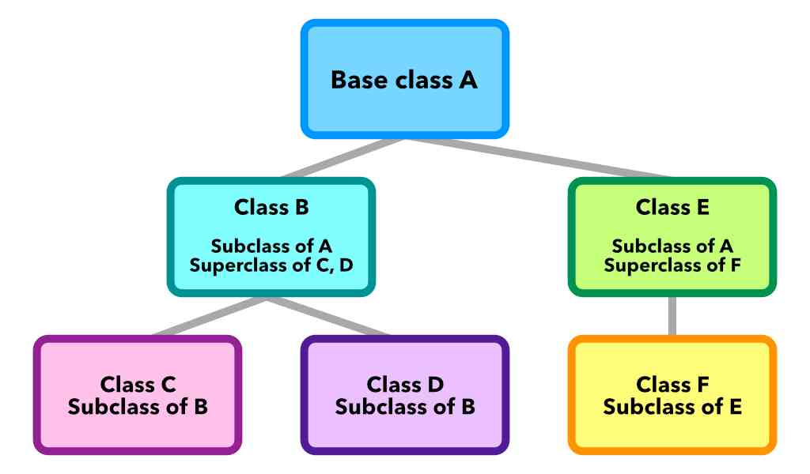

# What is inheritance?

**Inheritance** works very similarly to using [protocols](04.protocols.md) in that we define something in one class that will be used in another class. However, unlike protocols, inheritance also allows us to define the structure of *data* in addition to methods.

This means that not only can we define methods that will be used by other classes but members as well. Those classes can override the values but the members will always be there in each subclass.

## Base classes, superclasses, subclasses

As the name implies, inheritance works by a hierarchy: something receives the data and methods from something else, and it might pass that data and methods on to yet another thing. There are three main 'things' to consider:

- Base classes
- Superclasses
- Subclasses



### Base class

A base class in Python is one which does not inherit from any other class (technically, all classes inherit from a class called Object but that isn't important). In all the previous lessons, we created base classes.

Base classes are the simplest ones to define. Take this base class defining the features of a building: the number of storeys it has and the maximum number of occupants.

```python
from dataclasses import dataclass

@dataclass
class Building:
    number_of_storeys: int
    maximum_occupancy: int

    def occupancy_per_storey(self) -> int:
        return self.maximum_occupancy / self.number_of_storeys
```

### Superclasses and subclasses

Given a base class, we can define classes for different types of buildings. They all have in common that they have a certain number of storeys, but they differ in other details. These are **subclasses**. They inherit from another class, the **superclass**.

An easy way to remember: **Super**man flies above the **sub**way.

To declare a subclass, you specify the superclass in brackets directly after the name of the class, like so:

``class MySubclass(Superclass):``

```python
@dataclass
class OfficeBuilding(Building):
    number_of_elevators: int
    elevator_occupancy_limit: int
    business_names: list[str]

@dataclass
class SchoolBuilding(Building):
    number_of_classrooms: int

    def occupancy_per_classroom(self) -> int:
        return self.occupancy_per_storey() / self.number_of_classrooms
```

In the ``OfficeBuilding`` class, we:

- declared a subclass of ``Building``
- added some new members

In the ``SchoolBuilding`` class, we:

- declared a subclass of ``Building``
- added a new member
- added a new method that makes use of a method declared in the superclass, ``occupancy_per_storey()``

You can also create subclasses of other subclasses. In this case, the superclass is *not* considered a base class, just the superclass.

```python
from datetime import date, datetime

@dataclass
class TemporarySchoolBuilding(SchoolBuilding):
    date_to_dismantle: date

    @property
    def should_be_dismantled(self) -> bool:
        return datetime.now() >= self.date_to_dismantle
```

## Using subclasses

Subclasses are instantiated in the exact same way as base classes. You can access the properties from the superclass(es) in the subclass that you instantiate as well.

For example, the following works:

```python
building = Building(1, 10)
office = OfficeBuilding(10, 1000, 2, 12, ["Shop A", "Shop B"])
school = SchoolBuilding(3, 300, 10)
temp_school = TemporarySchoolBuilding(1, 60, 2, date(2025, 12, 31))

for building in [building, office, school, temp_school]:
    print(building.maximum_occupancy)
```

However, be careful not to access a member or method that doesn't exist in a given subclass. For example, ``OfficeBuilding`` and ``SchoolBuilding`` inherit from ``Building``, but ``SchoolBuilding`` does not inherit from ``OfficeBuilding``, so the following code would cause a crash:

```python
office = OfficeBuilding(10, 1000, 2, 12, ["Shop A", "Shop B"])
school = SchoolBuilding(3, 300, 10)

print(school.number_of_elevators)
```

