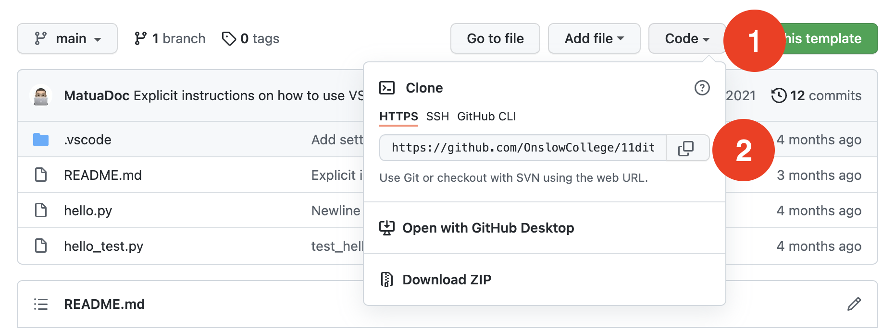

# Downloading code from Github

There are two ways to download code from Github into Visual Studio Code.

1. Using [Github Classroom](classroom.md)
2. [Manually, by checking out code via URL](#checking-out-code-manually-via-url)

## Checking out code manually via URL

### Copy the URL from Github

1. Go to [Github.com](https://github.com/)
2, In the Repositories section on the left, click on your assignment repository
3. Click on the Code button (1) and click the copy button (2)

### Check out the code in Visual Studio Code

4. Click the File menu → Close Folder
5. Click on the  Explorer tab
6. Click on the Clone Repository button
7. In the command palette, copy-paste the URL that you copied in step 3

# Commiting code to Github

When you make changes to a file or multiple files, commit the changes back to Github. This way, the files are stored on Github and you won't lose them.

1. Click on the  Source Control tab
2. You will see a list of files with changes. To send them to Github, you need to **stage the changes** to commit. Click on the  Add button next to those files.
3. In the box that reads Message, click and type a **commit message** that sums up the changes you have made. See this guide [how to write commit messages](https://gist.github.com/robertpainsi/b632364184e70900af4ab688decf6f53).
4. After you have staged your changes and entered a commit message, click on the  Commit button.
5. There are two ways to push the commit(s) to Github:
   1. Click on the Sync Changes button (if it is showing), **or**
   2. Click on the  button then click Push.