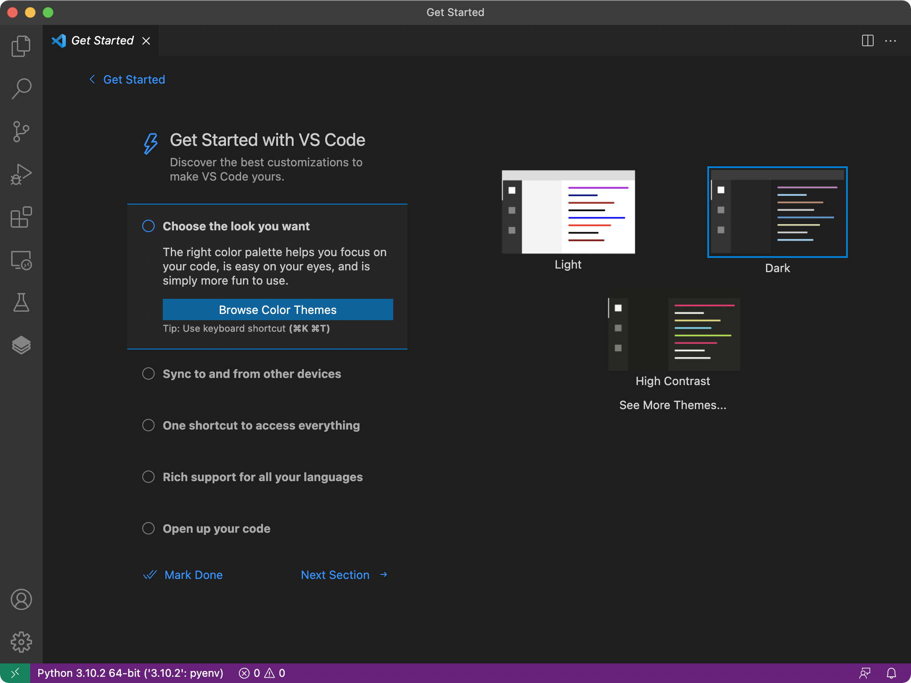

**Learning intentions**

- Set up your notebook with the necessary software
- Make sure all your school accounts are connected

**Success criteria**

You will know that you have completed this lesson's learning when:

- You have set up your school OneDrive
- You have downloaded and installed Python 3.10.2
- You have downloaded and installed Visual Studio Code
- You have configured Visual Studio Code correctly

--------

# 1. Set up your school OneDrive

In your courses, you will need to have access to some files at school and at home. The simplest way to achieve this is by using your school OneDrive.

## 1.1 Run OneDrive

On **Windows 10** and **Windows 11**:

- Click on the Start button (at the bottom-left of the screen) or press the Windows key on your keyboard
- Type "OneDrive"
- Click on the OneDrive icon

On **macOS**:

- Install [OneDrive for macOS](https://apps.apple.com/nz/app/onedrive/id823766827?mt=12) from the App Store
- Open the OneDrive program from the Applications folder, or by using Spotlight/Launchpad

## 1.2 Sign in with OneDrive

When OneDrive opens, you should see a window like the one below:


- Enter your school email address ending in ``@student.onslow.school.nz``
- Click Sign In
- On the next screen, enter your password

After you have signed in and set up OneDrive, your files will sync to your notebook.

From this point onwards, make sure **all** your work is saved to OneDrive. If you save any files on the school computer or your network drive, you will **not** be able to access your work at home.

# 2. Set up Python

## 2.1 Download Python

In 13DIT, you will continue learning Python.

To use Python, you will need to download and install it on your computer.

Download Python 3.10.2:
- for [Windows 10 and Windows 11](https://www.python.org/ftp/python/3.10.2/python-3.10.2-amd64.exe) then run the installer
  - on the first screen, **uncheck** Install launcher for all users
- for [macOS](https://www.python.org/ftp/python/3.10.2/python-3.10.2-macos11.pkg) then run the installer
- for Ubuntu Linux, use the [``pyenv-installer``](https://github.com/pyenv/pyenv-installer)
  - after you have installed ``pyenv``, open the Terminal app and run the following commands:
    - ```
      pyenv install 3.10.2
      pyenv global 3.10.2
      ```

# 3. Set up Git

## 3.1 Download and install Git

- Windows: [Download Git for Windows](https://git-scm.com/download/)
- macOS: Open the Terminal app and run the following command:
  - ```
    xcode-select --install
    ```
- Ubuntu: Open the Terminal app and run the following command:
  - ```
    sudo apt install build-essential
    ```

## 3.2 Install GitHub Desktop

Download [GitHub Desktop](https://desktop.github.com) for Windows and macOS

# 4. Set up Visual Studio Code

To edit your Python code, you will use Visual Studio Code. This is an integrated development environment that makes it easy to manage your Python files, test code, and get helpful suggestions when you're editing code.

## 4.1 Install Visual Studio Code

- [Download Visual Studio Code for Windows, macOS, and Linux](https://code.visualstudio.com), then run the installer.
- Open Visual Studio Code on your computer. When you first open it, you will see a window like this:



## 4.2 Set up extensions for Visual Studio Code

- Click on the  Extensions tab
- Search for "Onslow College DIT Extensions", then click Install
 
This will download and install the following extensions:
- **Python** (by Microsoft)
  - Adds support for the Python language.
- **Pylance** (by Microsoft)
  - Improved Python language support.
- **Pip Manager** (by slightc)
  - Download Python packages from Visual Studio Code.
- **GitLens** (by GitKraken)
  - Improved Git integration.
- **GitHub Classroom** (by GitHub)
  - Integrated access to GitHub Classroom exercises.
- **Error Lens** (by Alexander)
  - Shows the line where coding errors are occurring as well as a hint on how to fix it
- **indent-rainbow** (by oderwat)
  - Shows your current indentation level using colours
- **Markdown All in One** (by Yu Zhang)
  - Preview Markdown documents in Visual Studio Code while you write them.

## 4.3 Set up Visual Studio Code to use Python 3.10.2

- Click ``View menu → Command Palette…`` or press F1 (Windows) or Cmd-Shift-P (macOS) to show the Command Palette.
  - A text box will show at the top of the screen. 
  - Type "select interpreter". You will see an option called "Python: Select Interpreter" in the menu. Click on it.
    - 
  - Click on the option for Python 3.10.2
    - 

## 4.4 Set up Pytest

- After you have installed the Pip Manager extension, click on the Pip Manager icon on the left (it looks like a book or three stacked sheets of paper)
- Click the  Add button at the top
- In the Command Palette, type ``pytest`` and press Enter

## 4.5 Set up Settings Sync in Visual Studio Code

- Click on the  Accounts tab
- Click "Turn on Settings Sync"

- Click to sign in with your Microsoft account
  - Use your school email address and password to log in
  - Do **NOT** use your personal email address

If you use Visual Studio Code on a different computer, you will be able to repeat this process on it to use the same settings for all your computers.